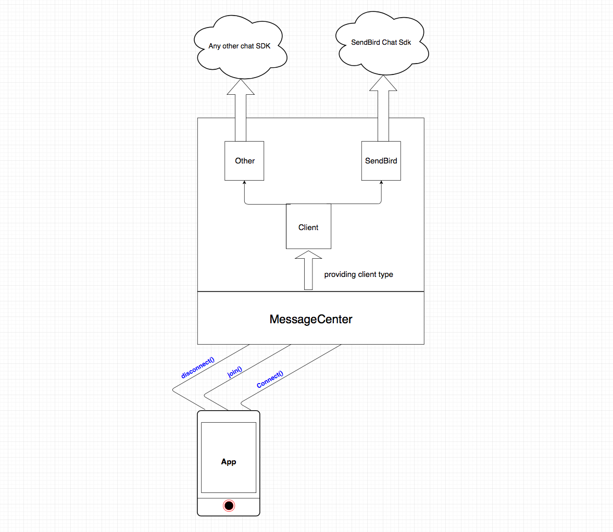

# Android-Message-Center
###Android messaging library 

### 1. Structure



### 2. Setup
* Add jitpack dependency to root build.gradle
    ```bash
        	allprojects {
        		repositories {
        			...
        			maven { url 'https://jitpack.io' }
        		}
        	}
     ```
 
 * Add the dependency 
    ```bash
	    dependencies {
	        implementation 'com.github.UsePace:android-message-center:{latest-version}'
	}
    ```
  
  * Add The following permission to Manifest.xml file 
    ```bash
        <uses-permission android:name="android.permission.WRITE_EXTERNAL_STORAGE" tools:node="replace"/>
    ```
  
  * In case of Manifest Failure, Add this under Application Tag 
    ```bash
     tools:replace="android:theme"
    ```

### 3. Sample App

  * For Debugging/Testing the library (to be able to run the library as an application) do the following:
  
  * Replace The `` build.gradle `` plugin from ``com.android.library`` to ``com.android.application``
  
  * Uncomment the Manifest ``todo: Uncomment for testing `` 
  
  * Test and debug method inside ``TestActivity.Java``, Default Launcher for the app
  
### 4. Usage

#### 4.0 Design
 * For toolbar title override the following string to strings.xml - strings-ar.xml
 
    ```bash
     <string name="message_center_toolbar_title">Title</string>
    ```
 * For colors styling override to colors.xml 
 
     ```bash
     <color name="message_center_primary">{color}</color>
     <color name="message_center_primary_dark">{color}</color>
     <color name="message_center_primary_accent">{color}</color>
     <color name="message_center_chat_view_background">{color}</color>
     ```

#### 4.1 connect()

 * First Step for integrating the app is to connect on the start of the application  
 
     ```bash
    MessageCenter.connect(Context context, ConnectionRequest connection, ConnectionInterface connectionInterface)
     ```
 
 * Connection Request Object Has the following items 

    *    String app_id; //The Application ID (provided from back-end)
    *    String user_id; // User id (provided from back-end)
    *    String access_token; //Access Token for Security (provided from back-end)
    *    String client; //Message Center is a Client Base Service, The only Client for now is   `MessageCenter.CLIENT_SENDBIRD`
    *    String fcm_token; //The FCM token for notification
    *    String apn_token; //for ios only
    
 * Connection Request Constructors 
    - public ConnectionRequest()
    - public ConnectionRequest(String client, String fcm_token, String app_id, String user_id, String access_token)
    
 * Sample Code for connecting to Message Center    
   
   ```bash
       MessageCenter.connect(this, connectionRequest, new ConnectionInterface() {
                      @Override
                      public void onMessageCenterConnected() {
                          
                      }
      
                      @Override
                      public void onMessageCenterConnectionError(int error_code, MessageCenterException mce) {
      
                      }
                  });
   ```

#### 4.2 getUnReadMessagesCount()
 * Getting Total of Unread Messages 
 
      ```bash
     MessageCenter.getUnReadMessagesCount(String chat_id, UnReadMessagesInterface unread_message_interface)
      ```
 * if chat_id is not provided, the sdk will retrieve the total unread messages for all channels 
 * if chat_id is provided, the sdk will retrieve the total unread messages for the provided channel
 * Sample code for retrieving the count 
    ```bash
    MessageCenter.getUnReadMessagesCount(chat_id: "channel_sample", new UnReadMessagesInterface() {
                      @Override
                      public void onUnreadMessages(int count) {
                              
                      }
          
                      @Override
                      public void onErrorRetrievingMessages(MessageCenterException e) {
          
                      }
                   });
    ```
 
#### 4.3 openChatView()
 * Joining the chat by url(id) provided
 * Sample code for joining a conversation
    ```bash
    MessageCenter.openChatView(context: this, chat_id: "sample_chat_id", theme: new Theme(toolbar: "title", toolbar_subtitle: "subtitle")); 
    ```
 * if Theme object is not provided, the app will take the defaults 
 * Theme Object for android have (```toolbar```, ```toolbar_subtitle```, ```welcome_message```) ..
 * Executing this interface will open the chatting window 
 
 #### 4.4 closeChatView()
  * Closing the chat view from the app side
  * Sample code for closing the chat view
     ```bash
     MessageCenter.closeChatView(context: this); 
     ```
  * Executing this interface will close the chatting window in the sdk


#### 4.5 sdkhandleNotification()

 * Handles only the related to MessageCenter Notifications 
 
 * Sample code for Handling MessageCenter Notification 
    ```bash
    MessageCenter.sdkHandleNotification(context: context,class: Class next, icon: R.mipmap.notifcation, title: "Message App", remotemessage: remoteMessage); 
    ```
 * if app was opened from notification you will get 2 extra fields with the intent 
    * CHANNEL_URL : a string url of the channel a message sent to 
    * FROM_NOTIFICATION : a boolean field defining if message came from notification

#### 4.6 appHandleNotification()

 * checks payload if its related to MessageCenter Notifications 
 
 * Sample code for Handling App MessageCenter Notification 
    ```bash
    MessageCenter.appHandleNotification(remotemessage: remoteMessage, interface: new AppHandleNoticiationInterface() { 
                      @Override
                      public void onMatched(JSONObject data) {
                          //JSON Object will moduled with next versions 
                          // to get the message call jsonObject.getString("message")
                          // to get the channel url call jsonObject.getJSONObject("channel").getString("channel_url")
                          // More information is provided with the JSON object, toString() to know more         
                      }
          
                      @Override
                      public void onUnMatched() {
          
                      }
                   });
    ```
    
#### 4.7 isConnected()

 * returns true if Message Center is connected 
 
 * Sample code for checking connection
    ```bash
    MessageCenter.isConnected();
    ```

#### 4.8 disconnect()

 * Disconnects the chat services and stop receiving notifications for chat, best case to use if with user logout 
 
 * Sample code for disconnecting
    ```bash
    MessageCenter.disconnect(new DisconnectInterface() {
                @Override
                public void onMessageCenterDisconnected() {
                    
                }
            });
    ```
